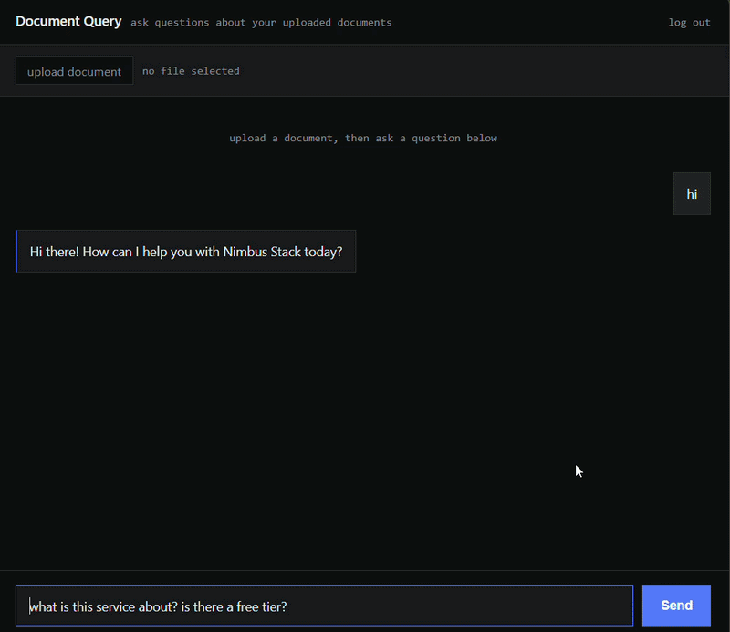

# AI Chat Backend — Turn Your Docs Into a Live Chatbot

A production-style backend that lets users upload documents and have a real-time, streaming conversation with an AI that answers using *their own content* — not generic AI hallucinations. Built for SaaS founders who want an AI support/chat feature without building the infrastructure from scratch.

**🔗 Live demo:** [ai-integration-rag-multi.onrender.com](https://ai-integration-rag-multi.onrender.com/)
Sign up, upload a document, and chat with it — it's live right now.


*Real-time streaming response — tokens appear as they're generated, just like ChatGPT.*

**💼 Open for freelance work** — I build backends like this for SaaS founders who need an AI chat/support feature. If this looks like something your product needs, let's talk:
📧 [your-email-here](revan8mata.dev@gmail.com) · 💼 [LinkedIn](https://www.linkedin.com/in/revan-8mata-13968a389/)

---

## What It Does

- Upload a PDF or text document, and instantly chat with an AI that answers questions grounded in that document (no more generic, made-up answers)
- Responses stream in real time, token by token
- Works with either Google Gemini or OpenAI under the hood — swap providers without touching your app
- Built-in user accounts, rate limiting, and webhook notifications so it's ready to sit behind a real product, not just a demo
- Two deployment modes available: a **shared knowledge base** (all users query the same admin-uploaded docs — good for a support bot) or **fully isolated per-user documents** (good for a personal AI assistant / private notes tool)

## Why This Exists

Founders adding AI features often end up gluing together an LLM API call and calling it done — no retrieval grounding, no streaming, no rate limiting, no auth. This project is what "AI chat feature, done properly" looks like: retrieval-augmented so answers are accurate, streamed so it feels responsive, and production-hardened so it doesn't fall over under real usage.

---

## Technical Overview

**Stack:** FastAPI (async Python) · PostgreSQL + pgvector · Redis · Docker / docker-compose · Alembic migrations

**Core features:**
- JWT authentication with admin/user role separation
- RAG pipeline: document upload → structure-aware chunking with overlap (LangChain-based) → Gemini embeddings → pgvector cosine-similarity retrieval
- Streaming responses via Server-Sent Events
- Multi-provider LLM abstraction layer (Gemini + OpenAI), including correct token-usage tracking for both
- Webhook system (document upload, new conversation, conversation deleted) — fires only after successful DB commit, with exponential-backoff retries and concurrent delivery
- Dual rate limiting (request-count and token-count) via Redis
- Two git branches for two business models: shared knowledge base (SaaS support bot) vs. isolated per-user documents (personal RAG)

**Engineering practices:**
- Full **pytest** test suite with reusable auth fixtures and guaranteed cleanup
- **CI/CD pipeline** via GitHub Actions — runs the full test suite against real Postgres/Redis services on every push
- Real bugs found and fixed through testing (e.g. a missing cascade-delete constraint caught by a foreign-key integrity test), not just "it works on my machine"

---

## Running It Locally

```bash
git clone https://github.com/revan8mata/ai-integration-rag-multi.git
cd ai-integration-rag-multi
docker-compose up --build
```

See `.env.example` for required environment variables (API keys, database URL, etc).

---

## Let's Build Something

If you're a founder who wants an AI chat or support feature added to your product, I build exactly this kind of thing.

📧 [your-email-here] · 💼 [LinkedIn](https://www.linkedin.com/in/revan-8mata-13968a389/)
